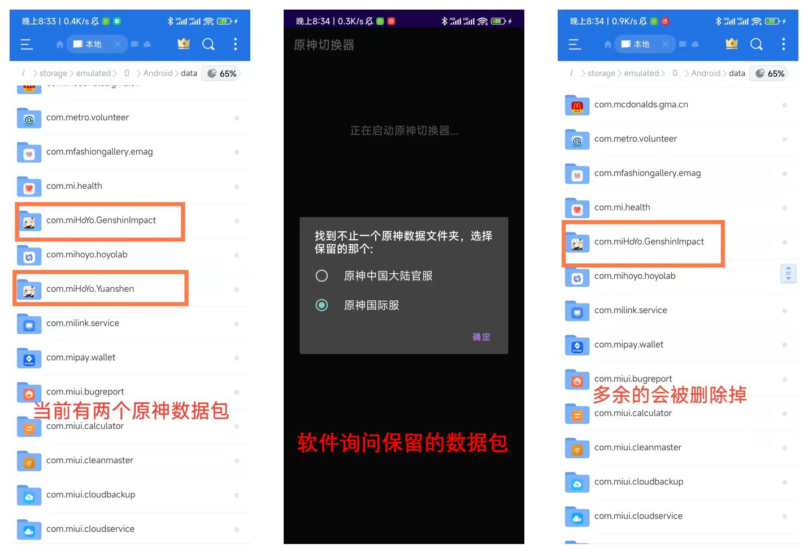
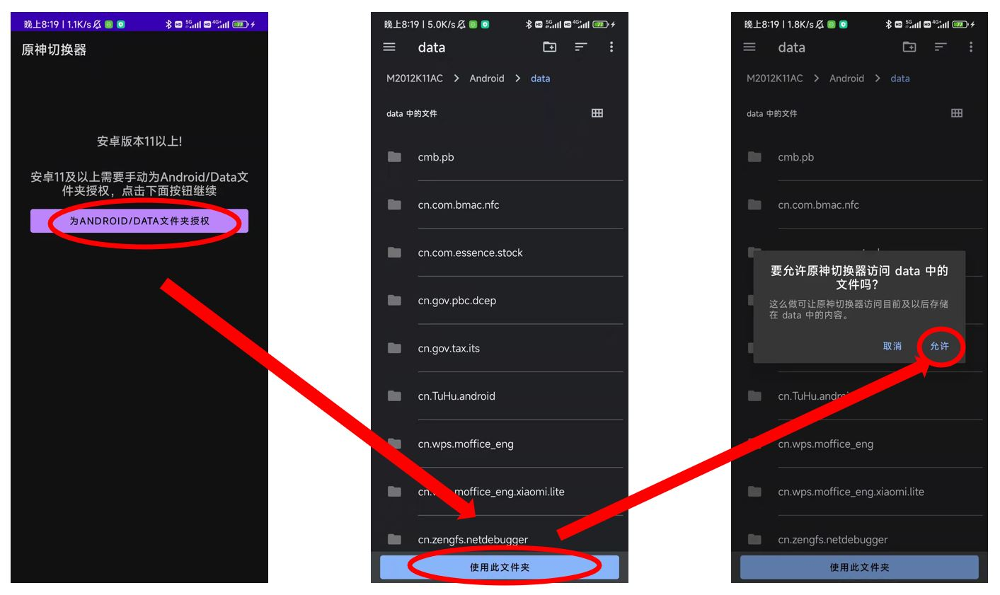

# 原神切换器
## 开发目的  
在安卓手机上，让多个不同版本的原神共存时仅使用一份数据，从而减少手机存储空间的消耗。  
## **使用前必读**  
### **这个工具是给谁用的**  
这个工具是为了那些同时**玩多个服**的玩家开发的，这些人有**至少两个以上不同服的账号**，这些人会在手机上**安装不止一个原神客户端**。  
此外对于某些国际服玩家，把游戏切换到国服去更新数据，能节省一点点下载时间，因为国际服下载有点慢。    
### **这个工具不能做什么**  
这个工具**不能**让你的B服/米服号转到官服/国际服，你的账号**不会发生任何变化**。  
### **这个工具能做什么**  
这个工具能让多个原神客户端公用一份游戏文件，从而**大大减少手机存储空间的消耗**。  
### **它的原理是什么**  
它的原理很简单。原神游戏安卓端任意服的客户端都使用**相同的游戏数据文件**，所以只需存一份游戏数据，然后启动不同客户端之前把数据改名为对应的名字即可。这个软件只是一个能快速重命名文件并启动游戏的工具而已。  
### **为什么我的数据找不到了/乱了**  
**（重要，必读）**  
如果**第一次使用这个工具**，或者**你同时更新了两个以上的游戏数据**，或者在**某个客户端没有对应数据的时候打开了这个客户端**，那么手机上的游戏数据文件夹**不再是唯一的**。这时候，软件会提示你选择保留的数据包。如果这时候**做了错误的选择**，那么正确的数据包就会被误删掉。这样也就导致了数据的错乱/误删。  
**正确的做法：** 询问保留的数据包时，选择**能玩**的那个。  
**举个例子：** 比如，手机上装了原神国际服和官服，想要用这个工具节省存储空间，**当前两个都能玩**。那么，第一次打开这个软件时，它会询问你保留哪个，这时候**选择任意一个**都行。然后，你现在正在玩国际服（也就是数据转移到国际服下面了），但是，某一次你不小心打开了官服，因为官服客户端**没有数据**，所以官服客户端会自动下载数据。如果这时候你把下载停掉了，那么官服客户端会有一份**不完整的数据**。当你再次打开切换器的时候，它问你保留哪个，这时候**如果**选了官服，那么**不完整的数据会留下**，从而**导致数据出错**。这时候应该选择**国际服**，因为**国际服的数据是完整的**，国际服可以直接玩。  
## 使用方法  
### 软件运行  
从release处下载该软件，然后安装到手机上。第一次启动时，软件会自动检测需要的权限并向用户申请相关权限。运行时，软件会自动检测当前安装的原神游戏版本，并自动判断当前的数据包。
### 切换原神版本  
使用时仅需点击切换然后选择想要启动的原神版本，软件就会将数据包转移给对应的原神版本。点击启动，即可启动当前版本的原神游戏。  
### 加速器启动  
如果想在玩的时候使用网游加速器，可以点击`选择网游加速器`按钮，软件会检测手机上安装的加速器并让用户选择。  
### 多个数据包  
如果当前手机上安装了多个版本的原神的数据包，那么软件检测到多个数据包时，会询问用户要保留的那个数据包，其余的数据包会被删掉。因为本来就没有必要留着多份的数据。 
  
**这里请选择能玩的那个游戏客户端，哪个能玩就选哪个。** 具体解释请看上面一节。
### 版本更新  
如果遇到版本更新，只需要在任意一个原神客户端内更新数据即可。  
## 支持原神版本  
- 原神渠道服-Bilibili
- 原神渠道服-小米
- 原神中国大陆官服
- 原神国际服  
## 运行所需权限
### 基础权限  
- 读写存储权限  
- 管理手机存储权限  
- 读取App列表权限  
### 对于安卓11及以上  
由于安卓11及以上，谷歌修改了访问文件的权限，每个app的数据都是以沙箱的形式独立存储，所以如果需要访问`Android/Data`下的文件，需要使用SAF(Storage Access Framework)，此时，需要额外在文件管理中为`Android/Data`文件夹授权。软件运行时会判断是否有这个权限并引导用户进行授权。  
  
### 隐私问题  
软件运行时会采集手机中安装软件等信息，目的是判断当前安装的版本。但是软件不会使用网络连接，更不会将采集到的信息发送到某个地方，所以请放心的为软件授予所需的全部权限。  
## 支持开发者
如果你觉得这个工具很好用，可以使用微信[支持开发者](./images/support.jpg)
